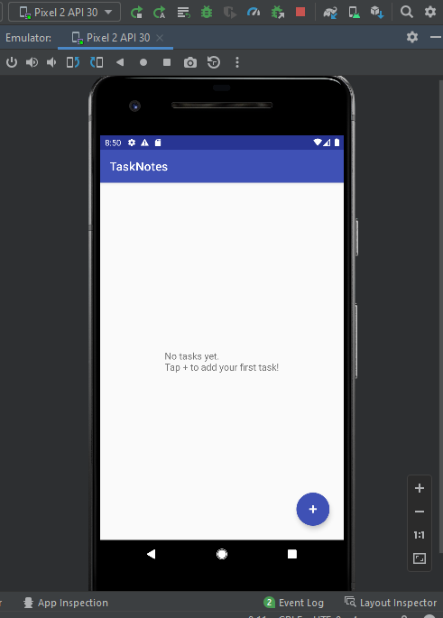
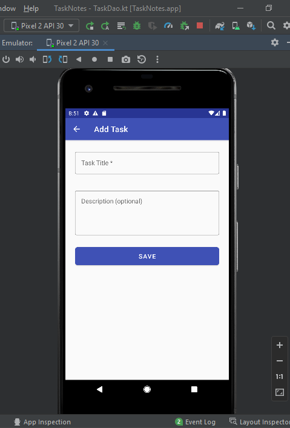

## Assignment 03 –Mini Project

Name- H.M.C.D.HERATH,  
 INDEX -14621

# TaskNotes – Personal Task/Notes Manager

A simple Android application for creating, viewing, and managing personal tasks and notes. Built as a mini-project to demonstrate UI design, data persistence, state management, basic architecture, and secure coding awareness.

---

## 📱 App Description

**TaskNotes** allows users to:
- **Add** new tasks/notes with a title and optional description
- **View** all saved tasks in a clean, scrollable list
- **Edit** existing tasks by tapping on them
- **Delete** tasks with a confirmation dialog
- **Mark tasks as completed** with a checkbox (strikethrough effect)
- **Persist data locally** – all data is saved to a local Room database and survives app restarts

The app works **completely offline** with no internet dependency.

---

## 🏗️ Architecture & Design Choices

### Architecture: MVVM (Model-View-ViewModel)

```
┌─────────────┐     ┌──────────────┐     ┌──────────────┐     ┌──────────┐
│   Activity   │────▶│  ViewModel   │────▶│  Repository  │────▶│   Room   │
│  (UI Layer)  │◀────│  (LiveData)  │◀────│              │◀────│   (DB)   │
└─────────────┘     └──────────────┘     └──────────────┘     └──────────┘
```

- **Model**: `Task` entity + Room Database (data layer)
- **View**: Activities with XML layouts (UI layer)
- **ViewModel**: `TaskViewModel` exposing `LiveData` (business logic layer)

### Data Persistence: Room (SQLite Abstraction)

Room was chosen over SharedPreferences because:
- It provides **compile-time SQL query verification**
- It integrates seamlessly with **LiveData** for reactive UI updates
- It supports **structured data** with full CRUD operations
- It handles **database migrations** gracefully

### State Management

- **ViewModel** survives configuration changes (screen rotation), preserving the task list
- **`onSaveInstanceState`** preserves unsaved text in EditText fields during rotation
- **LiveData** ensures the UI is always in sync with the data layer

### Technology Stack

| Component      | Technology                      |
|----------------|---------------------------------|
| Language       | Kotlin                          |
| Min SDK        | API 26 (Android 8.0)            |
| UI             | Material Components, RecyclerView |
| Data           | Room (SQLite)                   |
| State          | ViewModel + LiveData            |
| Async          | Kotlin Coroutines               |

---

## 🔒 Secure Coding Practices

The following secure coding practices are implemented and documented as inline comments:

1. **Data Storage Security** – Room stores data in the app's private internal storage, sandboxed by Android's file system permissions
2. **No Hardcoded Sensitive Data** – No API keys, passwords, or secrets in the codebase
3. **SQL Injection Prevention** – Room uses parameterized queries, preventing injection attacks
4. **Input Validation** – User input is validated (required fields, length limits) before saving
5. **Principle of Least Privilege** – No unnecessary permissions are requested
6. **User Confirmation for Destructive Actions** – Delete operations require explicit confirmation

---

## 📸 Screenshots

| Home Screen (Empty State) | Task List with Completed Items |
|:-------------------------:|:------------------------------:|
|  |  |
| *Empty state prompting user to add first task* | *Task 01 marked as completed with strikethrough* |

| Add Task (Empty Form) | Add Task (Filled Form) |
|:---------------------:|:----------------------:|
|  |  |
| *Material Design input fields with Save button* | *Entering task title and description* |

| Delete Confirmation |
|:-------------------:|
|  |
| *Confirmation dialog prevents accidental deletion* |

---

## Project Structure

```
TaskNotes/
├── app/
│   ├── src/main/
│   │   ├── AndroidManifest.xml
│   │   ├── java/com/example/tasknotes/
│   │   │   ├── data/
│   │   │   │   ├── Task.kt              # Room Entity
│   │   │   │   ├── TaskDao.kt           # Data Access Object
│   │   │   │   ├── TaskDatabase.kt      # Room Database singleton
│   │   │   │   └── TaskRepository.kt    # Repository pattern
│   │   │   ├── viewmodel/
│   │   │   │   └── TaskViewModel.kt     # ViewModel + Factory
│   │   │   └── ui/
│   │   │       ├── MainActivity.kt      # Main screen (task list)
│   │   │       ├── AddEditTaskActivity.kt # Add/Edit screen
│   │   │       └── TaskAdapter.kt       # RecyclerView adapter
│   │   └── res/
│   │       ├── layout/                  # XML layouts
│   │       └── values/                  # Colors, strings, themes
│   └── build.gradle                     # App dependencies
├── build.gradle                         # Project config
├── settings.gradle
└── README.md
```

---

